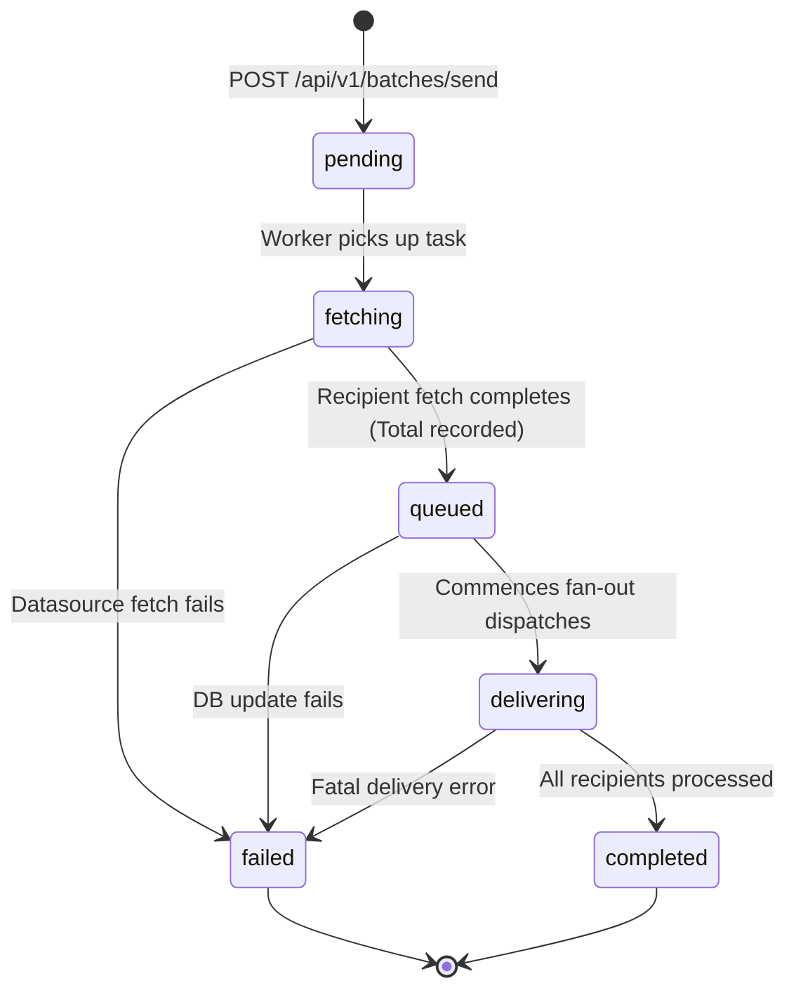
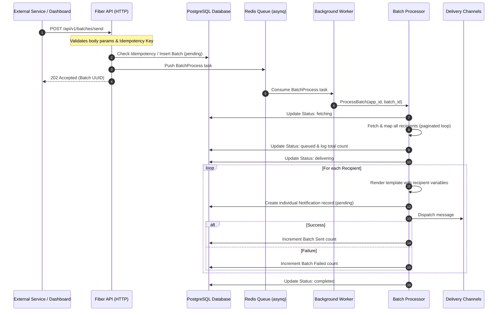

# Buzz Notification Service — Batches Feature

This document explains the architecture, lifecycle, and implementation details of the **Batches** feature in the Buzz Notification Service.

---

## 1. Feature Overview

The **Batches** feature allows users and integrated services to trigger large-scale notification campaigns (bulk sends) using templates and dynamic recipient lists from registered [Datasources](file:///home/oshanavishka06/BUZZ-SERVICE/docs/datasources.md).

Batches decouple HTTP request ingestion from the time-consuming process of fetching contacts, rendering templates, and negotiating connection handshakes with external providers (such as SMTP, Twilio, or Firebase Cloud Messaging).

---

## 2. Batch Lifecycle & Status Flow

A batch job transitions through several status states to allow dashboards and external monitors to track real-time progress:



### State Descriptions
1. **`pending`**: The campaign is created in the database and the task is pushed onto the Redis queue.
2. **`fetching`**: The background worker is calling the configured third-party REST API and iterating through paginated JSON payloads.
3. **`queued`**: All recipients have been resolved and the total count has been logged.
4. **`delivering`**: Loop is running to render templates with user variables and dispatch messages through delivery channels.
5. **`completed`**: The batch finished sending notifications to all resolved recipients.
6. **`failed`**: The execution was aborted due to incorrect endpoint credentials, templating errors, or database connectivity drops.

---

## 3. Architecture & Data Flow

When a batch is triggered, the ingestion and queue consumer flow coordinates tasks across several services:



---

## 4. Database Schema

Batches are tracked in the `batches` table, defined in the migrations folder:

```sql
CREATE TABLE batches (
    id UUID PRIMARY KEY DEFAULT gen_random_uuid(),
    application_id UUID NOT NULL REFERENCES applications(id) ON DELETE CASCADE,
    datasource_id UUID REFERENCES datasources(id) ON DELETE SET NULL,
    datasource_name VARCHAR(255) NOT NULL,
    endpoint_name VARCHAR(255) NOT NULL,
    endpoint_params JSONB NOT NULL DEFAULT '{}'::jsonb,
    template_name VARCHAR(255) NOT NULL,
    channel VARCHAR(50) NOT NULL,
    priority VARCHAR(50) NOT NULL DEFAULT 'normal',
    template_data JSONB NOT NULL DEFAULT '{}'::jsonb,
    
    -- Processing Stats
    status VARCHAR(50) NOT NULL DEFAULT 'pending',
    total INTEGER NOT NULL DEFAULT 0,
    sent INTEGER NOT NULL DEFAULT 0,
    failed INTEGER NOT NULL DEFAULT 0,
    skipped INTEGER NOT NULL DEFAULT 0,
    
    -- Safety & Logs
    idempotency_key VARCHAR(255),
    error_message TEXT,
    
    -- Telemetry
    started_at TIMESTAMPTZ,
    completed_at TIMESTAMPTZ,
    created_at TIMESTAMPTZ NOT NULL DEFAULT NOW(),
    updated_at TIMESTAMPTZ NOT NULL DEFAULT NOW()
);
```

---

## 5. Implementation Analysis

### 5.1 Request Handler & Idempotency
- **Endpoint**: `POST /api/v1/batches/send` in [batch.go](file:///home/oshanavishka06/BUZZ-SERVICE/internal/api/batch.go#L42).
- **Idempotency Guard**: Prior to creating a new batch, the API queries `GetBatchByIdempotencyKey`. If a key match is found, the endpoint returns the existing record immediately with `200 OK`, preventing duplicate runs for the same task.
- **Queue Hand-off**: [producer.go](file:///home/oshanavishka06/BUZZ-SERVICE/internal/queue/producer.go#L42) serializes the task into a JSON payload and pushes it to Redis.

### 5.2 Background Processing
- **Processor Logic**: Located in [processor.go](file:///home/oshanavishka06/BUZZ-SERVICE/internal/batch/processor.go#L40).
- **Variable Interpolation**: Performs template rendering using double curly braces notation `{{variable}}` on both subjects and bodies in `renderTemplateString`. It combines global batch variables (e.g. `due_date`) with recipient attributes (e.g. `name`).
- **Synchronous Send vs. Queue Ingestion**: 
  > [!NOTE]
  > The current [processor.go](file:///home/oshanavishka06/BUZZ-SERVICE/internal/batch/processor.go#L132) calls `p.provider.Send()` synchronously in the loop for each recipient. 
  > If a batch contains tens of thousands of contacts, this blocking loop can delay completion. An optimization is to modify this step to enqueue individual `asynq` tasks, fanning out delivery across multiple concurrent workers.
