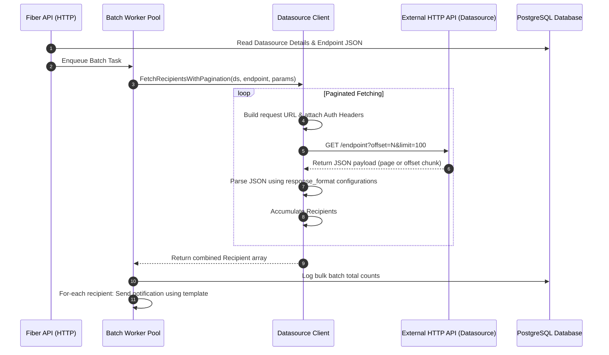

# Buzz Notification Service — Datasources Feature

This document explains the architecture, capabilities, and implementation details of the **Datasources** feature in the Buzz Notification Service.

---

## 1. Feature Overview

The **Datasources** feature enables Buzz to integrate directly with external API endpoints to dynamically fetch recipient lists for bulk notification campaigns (batches). 

Instead of requiring client applications to fetch contact lists and push them individually to Buzz over multiple HTTP requests, Buzz pulls the data directly from the source. It automates authentication, endpoint routing, pagination loops, and JSON parsing.

---

## 2. Architecture & Data Flow

When a bulk batch sending job is requested, the system uses the [Processor](file:///home/oshanavishka06/BUZZ-SERVICE/internal/batch/processor.go#L17) and the [Client](file:///home/oshanavishka06/BUZZ-SERVICE/internal/datasource/client.go#L16) to execute the following flow:



---

## 3. Database Schema

The datasources are configured inside the `datasources` table. The table schema includes support for credentials and JSON mapping configuration:

```sql
CREATE TABLE datasources (
    id UUID PRIMARY KEY DEFAULT gen_random_uuid(),
    application_id UUID NOT NULL REFERENCES applications(id) ON DELETE CASCADE,
    name VARCHAR(255) NOT NULL,
    description TEXT,
    base_url VARCHAR(2048) NOT NULL,
    auth_type VARCHAR(50) NOT NULL DEFAULT 'bearer',
    auth_config JSONB NOT NULL DEFAULT '{}'::jsonb,
    endpoints JSONB NOT NULL DEFAULT '{}'::jsonb,
    active BOOLEAN NOT NULL DEFAULT TRUE,
    created_at TIMESTAMPTZ NOT NULL DEFAULT NOW(),
    updated_at TIMESTAMPTZ NOT NULL DEFAULT NOW(),
    CONSTRAINT datasources_app_name_key UNIQUE (application_id, name)
);
```

### Key Configurations Stored as JSONB
- **`auth_config`**: Contains auth secrets keyed by the `auth_type` definition.
- **`endpoints`**: Contains a dictionary of paths, methods, pagination, and response-mapping keys.

---

## 4. Capabilities & Features

### 4.1 Authentication Protocols
Buzz supports three authentication types for third-party integrations:
- **Bearer Token**: Automatically injects `Authorization: Bearer <token>` header.
- **Basic Auth**: Injects standard `Authorization: Basic <base64(username:password)>` credentials.
- **API Key**: Attaches a custom header (e.g. `X-API-KEY: key_value`) as defined by the datasource.

### 4.2 Query Parameter & Path Injection
API endpoints support path parameters. If the endpoint path is registered as `/courses/{course_id}/students` and the trigger payload includes `{"course_id": "cs-101"}`, the path is dynamically resolved to `/courses/cs-101/students` during dispatch. Other payload arguments are attached automatically as URL query parameters.

### 4.3 Pagination Handlers
To prevent hitting API timeouts and memory limits on large sets, Buzz parses paginated endpoints using two distinct styles:
1. **`offset` (Default)**: Automatically queries endpoints by appending `offset=N&limit=100`. It increases the offset count iteratively until the API returns fewer than 100 entries.
2. **`page`**: Queries endpoints by appending `page=N&per_page=100` (1-based index).

### 4.4 Dynamic Response Parsing
Since external systems structure user profiles differently, the endpoint config contains a `response_format` structure that maps keys to the standardized Buzz [Recipient](file:///home/oshanavishka06/BUZZ-SERVICE/internal/datasource/client.go#L21) struct:

```json
"response_format": {
  "recipients_key": "students",       // Array location inside response JSON
  "name_field": "student_name",       // Mapping for contact name
  "email_field": "student_email",     // Mapping for email address
  "phone_field": "student_phone",     // Mapping for phone number
  "device_token_field": "fcm_token"   // Optional FCM device token mapping
}
```

---

## 5. Implementation Walkthrough

### 5.1 Step 1: Registering a Datasource
A tenant application registers a datasource using the dashboard UI or by hitting `POST /api/v1/datasources`:

```json
{
  "name": "lms_api",
  "base_url": "https://api.lms.domain.local/v1",
  "auth_type": "bearer",
  "auth_config": {
    "token": "secret_lms_token_abc123"
  },
  "endpoints": {
    "get_students": {
      "path": "/courses/{course_id}/students",
      "method": "GET",
      "pagination_style": "page",
      "response_format": {
        "recipients_key": "data",
        "name_field": "full_name",
        "email_field": "email",
        "phone_field": "phone"
      }
    }
  }
}
```

### 5.2 Step 2: Triggering a Dynamic Batch Send
Once registered, a client triggers a bulk sending job by posting to `/api/v1/batches/send`:

```json
{
  "datasource_id": "3587e9cf-5f8e-4a6c-941f-82ffba8b3f2b",
  "endpoint_name": "get_students",
  "endpoint_params": {
    "course_id": "cybersecurity-101"
  },
  "template_name": "CourseAlert",
  "channel": "email",
  "priority": "high",
  "template_data": {
    "announcement_title": "Quiz Tomorrow",
    "due_date": "June 25th"
  }
}
```

### 5.3 Step 3: Fetching and Sending
The backend worker pulls this task, makes sequential paginated GET requests to:
`https://api.lms.domain.local/v1/courses/cybersecurity-101/students?page=1&per_page=100`

It parses the `data` array in the response, maps attributes (`full_name` $\rightarrow$ `name`, etc.), merges variables, and queues notifications dynamically.
